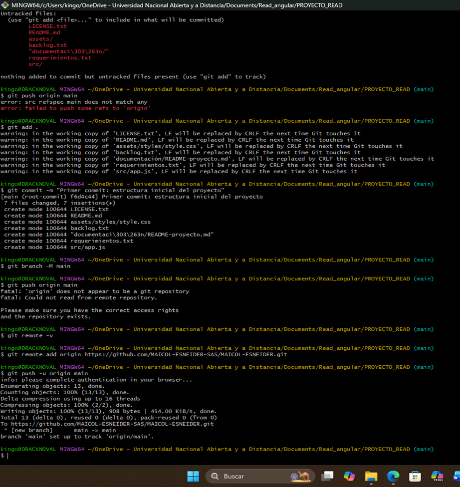
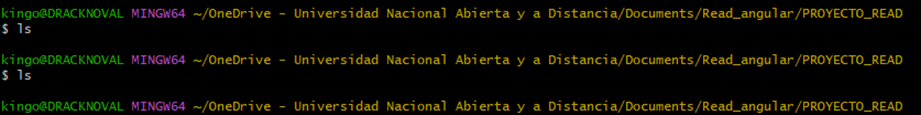
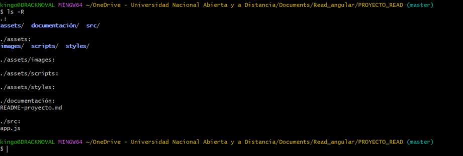

# BITÁCORA DE DESARROLLO – GESTIÓN DEL PROYECTO CON GIT Y GITHUB

**Proyecto:** Plataforma Web “MAICOL ESNEIDER S.A.S.”  
**Tecnologías:** Git y GitHub  
**Autor:** Maicol Esneider Posada Callejas  

---

## 1. Introducción
El desarrollo de la plataforma web orientada a la evaluación del bienestar mediante la *“Rueda de la Vida”* requiere un control de versiones organizado y confiable.  
Por ello, se implementaron prácticas profesionales utilizando **Git** y **GitHub**.  

Esta bitácora registra cada uno de los pasos desarrollados, la estructura creada, los comandos utilizados y las evidencias capturadas durante el proceso.  
**Objetivo principal:** asegurar un flujo de trabajo ordenado, con trazabilidad clara y estabilidad en cada versión del proyecto.

---

## 2. Objetivo General
Documentar las acciones realizadas durante la configuración, administración y control de versiones del proyecto utilizando Git y GitHub, garantizando organización, control de cambios y manejo adecuado de repositorios y ramas.

---

## 3. Desarrollo de Actividades

### 3.1 Creación, configuración y clonación del repositorio
Se creó el repositorio remoto dentro de la organización asignada en GitHub.  
Posteriormente, se realizó el proceso de clonación en el equipo local mediante el comando:

```bash
git clone <URL_del_repositorio>
Con el repositorio clonado, se inició el desarrollo del proyecto y se procedió a organizar la estructura inicial.
```


### 3.2 Creación de la estructura del proyecto
Una vez clonado el repositorio, se creó la estructura de carpetas necesaria para organizar de manera adecuada los archivos del proyecto.

-Carpetas establecidas:

-documentación

-src

-assets

-images

-scripts

-styles

-Archivos base añadidos:

-README.md

-LICENSE.txt

-backlog.txt



### 3.3 Confirmación de archivos iniciales y primeros commits
Con la estructura creada, se verificó que los archivos estuvieran correctamente ubicados dentro del proyecto utilizando los comandos:

```bash
ls
git status
Luego se efectuaron los primeros commits del proyecto:


git add .
git commit -m "Estructura inicial del proyecto y archivos base"
git push origin main
Este proceso permitió validar que Git reconociera la estructura completa y que el repositorio remoto quedara sincronizado correctamente.
```


## 4. Gestión de Ramas
### 4.1 Creación de la rama de trabajo
Para trabajar de manera ordenada y sin afectar la rama principal, se creó una nueva rama:

```bash
git checkout -b diseño-pagina-inicial
Esta rama permitió avanzar en la interfaz inicial de la página principal sin comprometer el funcionamiento del proyecto en la rama main.
```
### 4.2 Desarrollo dentro de la rama
Dentro de la rama creada, se realizaron avances incrementales, aplicando buenas prácticas mediante commits frecuentes. Ejemplo de mensaje utilizado:

```bash
git commit -m "Avances en el diseño inicial de la página principal"
```
### 4.3 Integración de los cambios (Merge)
Cuando la funcionalidad estuvo completa, se realizó la integración hacia la rama principal. El proceso incluyó la creación de un Pull Request desde GitHub y la revisión de posibles conflictos.

En caso de conflictos, se utilizó el comando:

```bash
git merge main
Los conflictos se resolvieron manualmente para asegurar la estabilidad del proyecto antes de completar la integración.
```
### 4.4 Verificación final de la integración
Una vez aceptado el Pull Request, los cambios quedaron integrados correctamente en la rama main. Después de la fusión, se verificó nuevamente el estado del proyecto y su funcionamiento adecuado, garantizando continuidad para las siguientes etapas de desarrollo.

## 5. Conclusiones
El uso de Git y GitHub permitió mantener un control de versiones profesional, organizado y completamente documentado.

### Gracias al manejo de ramas:

-Los avances se realizaron sin afectar la estabilidad del proyecto.

-Se trabajó con orden y seguridad.

-Las evidencias capturadas confirman que la estructura inicial, los archivos y los cambios realizados quedaron correctamente establecidos dentro del repositorio.
