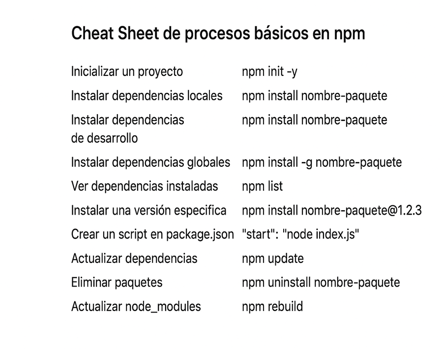

# Gestión de Dependencias en JavaScript con npm

**Autor:** Maicol Esneider Posada Callejas  
**Institución:** Servicio Nacional de Aprendizaje – SENA  
**Año:** 2025  

---

## 1. Introducción

En el desarrollo moderno de aplicaciones JavaScript, los gestores de dependencias cumplen un papel fundamental para mantener los proyectos organizados, funcionales y escalables.  

En esta actividad se presentan los conceptos esenciales relacionados con **npm**, el sistema de paquetes más utilizado en JavaScript, así como el significado de las dependencias, los archivos importantes del proyecto y el versionado semántico.  

**Objetivo:** comprender, de manera clara y aplicada, cómo funcionan estos elementos y por qué son indispensables dentro del entorno de trabajo profesional.

---

## 2. Tabla de Contenidos

1. ¿Qué es un gestor de dependencias de código?  
2. ¿Qué es npm?  
3. ¿Para qué se utiliza principalmente npm?  
4. ¿Qué es el versionado semántico?  
5. ¿Cómo está especificado el versionado semántico?  
6. ¿Qué son las dependencias locales?  
7. ¿Qué son las dependencias de desarrollo?  
8. ¿Qué son las dependencias globales?  
9. ¿Qué es el archivo package.json y para qué sirve?  
10. ¿Qué es el archivo package-lock.json y cuál es su utilidad?  
11. ¿Qué es la carpeta node_modules en un proyecto de npm?  
12. Cheat Sheet de procesos básicos en npm  
13. Conclusiones  
14. Referencias  

---

## 3. Desarrollo

### 3.1 ¿Qué es un gestor de dependencias de código?
Un gestor de dependencias de código es una herramienta que permite instalar, actualizar, eliminar y administrar librerías o paquetes que un proyecto necesita para funcionar.  
Facilita el manejo de versiones, evita conflictos entre paquetes y ofrece una forma organizada de mantener el proyecto estable sin tener que descargar archivos manualmente.  
Su uso es obligatorio en proyectos modernos debido a la gran cantidad de librerías externas que se emplean actualmente.

---

### 3.2 ¿Qué es npm?
**npm** es el gestor de paquetes oficial de Node.js y la herramienta más utilizada en el ecosistema JavaScript.  
Permite instalar librerías de terceros, administrar versiones y crear scripts automatizados dentro de un proyecto.  
También funciona como un repositorio en línea donde millones de desarrolladores publican paquetes de código abierto.

---

### 3.3 ¿Para qué se utiliza principalmente npm?
npm se utiliza para:
- Instalar dependencias o librerías necesarias para un proyecto.  
- Administrar versiones de paquetes.  
- Ejecutar scripts como iniciar un servidor, correr pruebas o compilar código.  
- Gestionar la configuración general del proyecto mediante archivos como `package.json`.  
- Instalar herramientas globales que sirven de apoyo al desarrollo.  

---

### 3.4 ¿Qué es el versionado semántico?
El versionado semántico es un estándar que define cómo deben numerarse las versiones de un paquete.  
Permite identificar los cambios realizados en una librería y determinar si una actualización puede romper el proyecto o no.  
Su objetivo es mantener un control ordenado y predecible de las versiones.

---

### 3.5 ¿Cómo está especificado el versionado semántico?
El versionado semántico sigue la estructura **MAJOR.MINOR.PATCH (X.Y.Z):**

- **Major (X):** Cambios grandes o incompatibles con versiones anteriores.  
- **Minor (Y):** Nuevas funciones que no afectan compatibilidad.  
- **Patch (Z):** Corrección de errores sin modificar funcionalidades existentes.  

**Ejemplo:** `5.2.1`

---

### 3.6 ¿Qué son las dependencias locales?
Son librerías instaladas dentro del proyecto y almacenadas en la carpeta `node_modules`.  
Solo están disponibles para ese proyecto específico y se usan durante la ejecución normal de la aplicación.

---

### 3.7 ¿Qué son las dependencias de desarrollo?
Son paquetes que se utilizan únicamente durante el proceso de desarrollo, pero no son necesarios en producción.  
Ejemplos: frameworks de pruebas, herramientas de compilación o servidores locales.

---

### 3.8 ¿Qué son las dependencias globales?
Son paquetes instalados a nivel del sistema operativo y disponibles para cualquier proyecto.  
Generalmente se utilizan para ejecutar herramientas de consola, como `nodemon` o `npm-check-updates`.

---

### 3.9 ¿Qué es el archivo package.json y para qué sirve?
El archivo `package.json` es el corazón del proyecto. Contiene información clave como:
- Nombre y versión del proyecto  
- Dependencias y dependencias de desarrollo  
- Scripts personalizados  
- Configuraciones específicas de paquetes  
- Autor, licencia y descripción  

**Utilidad principal:** permitir que otros desarrolladores puedan instalar las dependencias del proyecto con un solo comando.

---

### 3.10 ¿Qué es el archivo package-lock.json y cuál es su utilidad?
Este archivo guarda la versión exacta de cada dependencia instalada.  
Su función es garantizar que todos los desarrolladores del proyecto tengan las mismas versiones, evitando errores por cambios inesperados.  
Además, acelera la instalación de paquetes.

---

### 3.11 ¿Qué es la carpeta node_modules en un proyecto de npm?
Es la carpeta donde se almacenan físicamente todos los paquetes instalados en el proyecto.  
Puede ocupar mucho espacio, ya que contiene dependencias y subdependencias.  
Por su tamaño, nunca se sube a GitHub ni a repositorios.

---

### 3.12 Cheat Sheet de procesos básicos en npm

## 4. Conclusiones

La gestión de dependencias es un proceso esencial para cualquier desarrollador que trabaje con JavaScript y Node.js.. Entender cómo funciona npm, el versionado semántico, las dependencias y los archivos del proyecto permite mantener un entorno de trabajo ordenado, eficiente y estable.

### Esta actividad demuestra que dominar estas herramientas:

-Reduce errores

-Mejora el trabajo en equipo

-Acelera el desarrollo de aplicaciones profesionales

## 5. Referencias

-Google. (2024). Node.js Package Manager Documentation.

-Mozilla Developer Network. (2024). JavaScript Guide.

-npm, Inc. (2024). npm Documentation. https://www.npmjs.com/