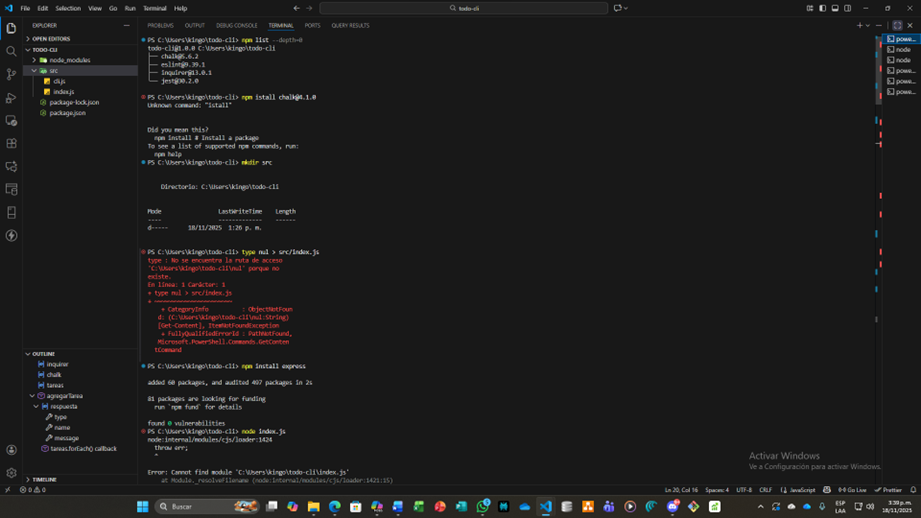
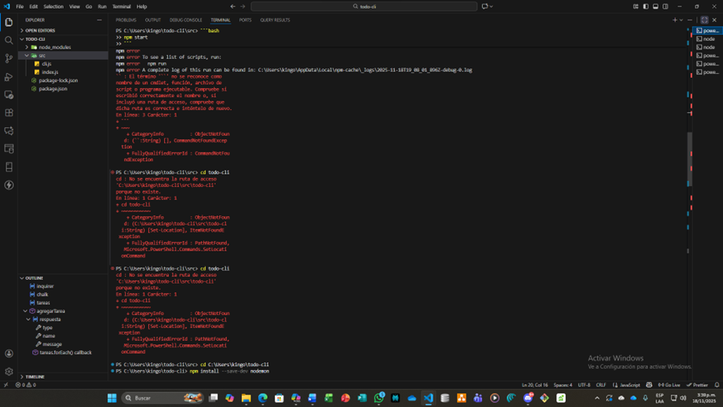
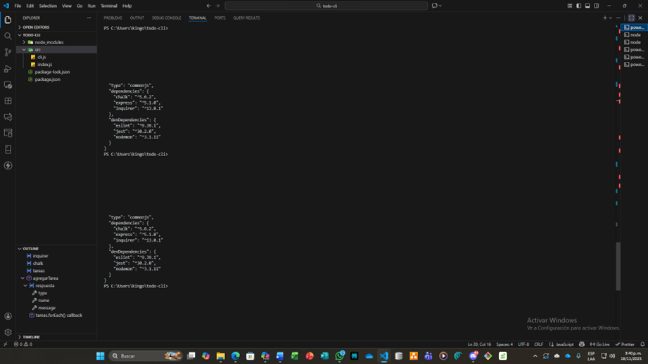
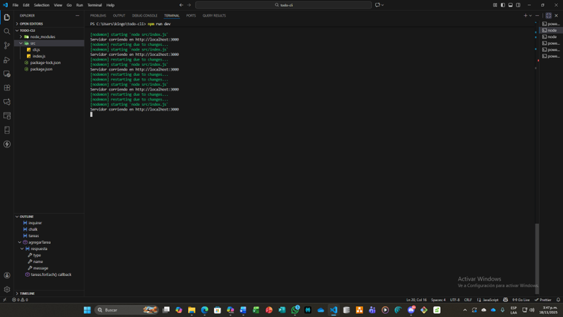
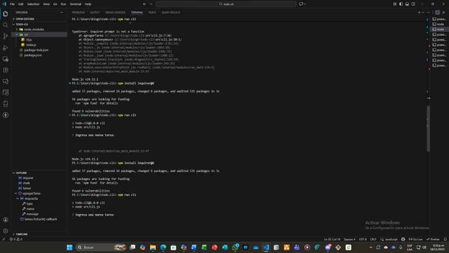

# Bitácora de Desarrollo

**Actividad:** 3.3 Actividades de apropiación  
**Código:** GA1-220501096-03-AA1-EV03  
**Tema:** Manejo práctico del gestor de dependencias NPM  
**Aprendiz:** Maicol Esneider Posada Callejas  

**Repositorio GitHub:** [MAICOL-ESNEIDER-SAS/Actividad_3_guia_2_Manejo_de_pendencias_NPM](https://github.com/MAICOL-ESNEIDER-SAS/Actividad_3_guia_2_Manejo_de_pendencias_NPM) 

---

## 1. Introducción

Esta bitácora presenta de manera detallada el proceso realizado para instalar, configurar y utilizar el gestor de dependencias **npm** dentro de un proyecto desarrollado en **Node.js**, llamado `todo-cli`.

Durante el procedimiento se empleó la terminal de Visual Studio Code, ejecutando diferentes comandos para instalar paquetes, crear scripts, solucionar errores y poner en funcionamiento el proyecto.

**Objetivo principal:** fortalecer el dominio práctico del uso de npm como una herramienta esencial en el desarrollo con JavaScript.

---

## 2. Desarrollo del Taller

### 2.1 Instalación y Verificación de Node.js

Se instaló Node.js siguiendo la guía oficial y posteriormente se verificaron las versiones instaladas mediante los comandos:

```bash
node -v
npm -v
Luego se creó el proyecto todo-cli y se inicializó npm con:

npm init -y
Este proceso generó el archivo package.json, el cual contiene la configuración base del proyecto.
```
## Imagen 1: Verificación de instalación y estructura inicial del proyecto.



### 2.2 Instalación de Dependencias
Se instalaron las dependencias principales:

```bash
npm install chalk inquirer jsonwebtoken
Y las dependencias de desarrollo:


npm install --save-dev nodemon eslint
La instalación generó la carpeta node_modules y actualizó el archivo package-lock.json, reflejando la correcta incorporación de las dependencias.
```
## Imagen 2: Instalación de dependencias y estructura del proyecto.



### 2.3 Configuración de Scripts y Ejecución
Se editaron los scripts del archivo package.json de la siguiente forma:

```json
"scripts": {
  "start": "node src/index.js",
  "dev": "nodemon src/index.js",
  "cli": "node src/cli.js"
}
Posteriormente se ejecutaron los comandos:
```
```bash 
npm start
npm run dev
npm run cli
El servidor inició correctamente en la dirección:

Código
http://localhost:3000
```
## Imagen 3: Ejecución del servidor con nodemon.



### 2.4 Manejo de Errores y Solución
Durante la práctica surgieron diversos errores:

-Módulos no encontrados, como chalk o inquirer.

-Scripts faltantes, especialmente el script start.

-Problemas vinculados a versiones de Node.js..

-Estas situaciones se solucionaron instalando las versiones correctas, ajustando rutas y corrigiendo configuraciones en el proyecto.

## Imagen 4: Registro de errores y comandos utilizados para solucionarlos.



### 2.5 Interacción CLI con Inquirer
Se desarrolló una interfaz CLI utilizando la librería inquirer, permitiendo ingresar tareas desde la terminal.

Al inicio se presentó el error:
```bash
Código
inquirer.prompt is not a function
Este se corrigió instalando una versión compatible:
```
```bash
npm install inquirer@8
Después de esto, el CLI funcionó adecuadamente y permitió capturar las tareas ingresadas por el usuario.
```
## Imagen 5: Funcionamiento del CLI interactivo con inquirer.



## 3. Conclusiones
### El uso de npm dentro del proyecto permitió:

-Configurar un entorno funcional en Node.js..

-Instalar y administrar dependencias correctamente.

-Automatizar tareas mediante scripts.

-Resolver errores comunes durante el desarrollo.

-Implementar una interfaz CLI interactiva.
``` bash
4. Tabla de Comandos Usados
Comando	                Función
npm init -y	            Inicializa el proyecto
npm install chalk	    Instala la librería chalk
npm install inquirer	Instala la librería inquirer
npm run dev	            Ejecuta el servidor con nodemon
npm install inquirer@8	Instala versión compatible de inquirer
